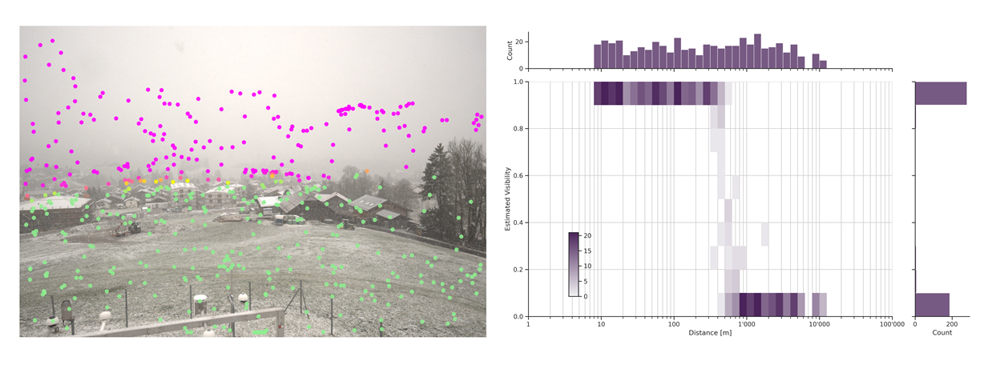
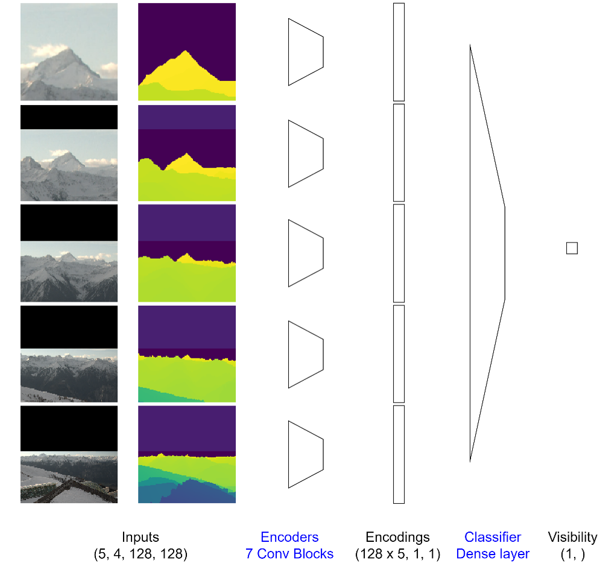
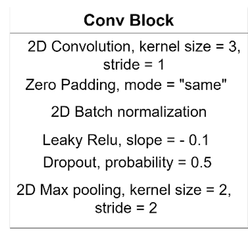

# CAMVIS2 - Estimation of Visibility on Webcam Images using Multi-Magnification Convolutional Networks



## Quickstart
This section provides instruction to build the dataset and replicate the experiments we made. Instructions are provided for Ubuntu/Linux systems only. If you want to use a different OS, you may need to install required libraries manually in order to avoid compatibility issues.
### Overall Setup

#### Enable GPU Acceleration
If you have a NVIDIA GPU with cuda capabilities, it is strongly advised to use it for computations.
You can determine if you already have a GPU driver and its version by executing the following command.
```bash
nvidia-smi
```
If you don't have one yet, you can find an appropriate driver for your graphics card on the [NVIDIA Download Drivers](https://www.nvidia.com/Download/index.aspx?lang=en-us) webpage so you can speed up your computations.

If you have an AMD GPU with ROCm capabilities, you can use it instead of an NVIDIA GPU. To do this, you will have to install dependencies without versions matching and use the ROCm version of pytorch.

Finally, if you don't have a GPU, you'll have to install dependencies without versions matching and use the CPU version of torch. It is however noteworthy that while inference using the CPU is doable, training a model on CPU is generally extremely time consuming and thus not advised.

#### Setup the Environment
In order to install dependencies, it is advised to create a virtual environment. We recommand to install and use [pyenv](https://github.com/pyenv/pyenv), although any python environment manager will do.
You can create a virtual environment (and enable it) as shown in the command below (replace myenv with the desired name). 

It is advised to use Python 3.10.12 as other versions could lead to compatibility issues. If you want to use a different version, you might need to install the dependencies without versions matching.
```bash
pyenv virtualenv 3.10.12 myenv
pyenv activate myenv
```

#### Install Dependencies (A) With Versions Matching
Now that the virtual environment is created, you can install the needed libraries provided in the requirements.txt file as follows : 
```bash
pip3 install --upgrade pip
pip3 install -r requirements.txt
```

#### Install Dependencies (B) Without Versions Matching
Alternatively, you can install the required packages without specifying the version you want. This allows for a more flexible install in case the fixed version install failed, or if you want to use a specific version of python or an AMD GPU. However, this might cause some errors as code may become deprecated in future versions of packages.

First, update your package installer (command provided for pip)
```bash
pip3 install --upgrade pip
```

Then, go on the pytorch [start locally](https://pytorch.org/get-started/locally/) page. There, you can set your OS, package installer etc and get the appropriate command to install pytorch in your environment. If you want to use an AMD GPU, you'll have to select the ROCm compute platform. For CPU, select the CPU compute platform. For an NVIDIA GPU, select a CUDA platform.

Once you ran your install command, install the remaining dependencies as follows.
```bash
pip3 install -r utils/requirements_no_version.txt
```

#### Check Dependencies
In oder to check whether all dependencies are correctly installed and imported you can run the command below.
```bash
python utils/check_imports.py
```
If you get no error and the message "All packages have been successfully imported" appears in your console, you should be good to go!
### Dataset Creation
Download the webcam images and the depthmaps from this link *link to come*. 
Uncompress the depth_maps.tar.gz file and put its contents in data/raw/depth_maps. 
Similarly, put the content of the uncompressed images.tar.gz in data/raw/images. 
You can now create the dataset files by executing the command below.
```bash
python data/make_dataset.py
```
In addition to the .gitkeep file, you should now have 5 .pt files and the metadata csv file in the data/processed directory

### Model Training and Evaluation
In this section, you will find information on how to train and evaluate a model architecture on the dataset you previously computed. You will train the model architecture using a 9-fold cross validation and visualize the validation performance on each fold using bootstrapping. In this case, we train our best performing architecture, and we call the experiment **mymodel**.

The model/run.py script allows to launch experiments. It comes with a parser that allows to define, among other things :  
+ whether we want to run the model in training or running mode
+ what is the model architecture going to be
+ typical hyperparameters
+ files to save logs and checkpoints of model weights

#### Train the Model
For convenience, we provide bash files with pre-written run.py commands and arguments. However, it is strongly advised to familiarize yourself with the run.py arguments parser if you want tu use this project more extensively. You can find information about how to use it in the **Run Parser** section.
To train the model on the training sets of each fold, execute the following script.
```bash
bash train_model.sh
```

Training the model on 9 different folds takes close to 7 hours when using an NVIDIA A100 GPU. 

You can follow the training of the model on each fold using tensorboard. To launch a tensorboard session, run the command below in another terminal.
```bash
tensorboard --logdir outputs/training_logs
```

#### Evaluate the Model
Once model weights are trained, you can infer on the validations sets for each fold by executing the command below.
```bash
bash eval_model.sh
```

#### Visualize Results
For each fold, you can see the results of the inference on the validation set in subdirectories of outputs/, in the directories named with **mymodel** and a fold. 
+ Confusion matrices are available in outputs/val_cf_matrices
+ Ground-truth and prediction on webcam images are available in outputs/val_images
+ Histplots of distance vs visibility are available in outputs/val_histplots
+ Bootstrapped performances in terms of loss, accuracy and f1 score are available in outputs/val_scores

Once everything is finished, you can create visualizations of the results using the command below. NB the -v flag will show graphs in a pop-up window. You can remove it if you don't want it.

```bash
python outputs/visualize_scores.py -n mymodel -s -v
```
This will create a subdirectory in outputs/val_scores with the same name as the scores file. Inside the directory, you can find visualizations of accuracies, f1 scores and loss values across folds for this model architecture.

### Architecture Comparison Experiment
In this experiment, you will train two model architectures using a 9-fold cross validation and compare the results using bootstrapping on the validation performance. One of the model architecture concatenates the features of the patches at different magnification levels, while the other one appends them with scaling so that features are physically aligned from one level to another. Thus, the two architectures are called **cat** and **align** and we call this experiment **cat_vs_align**.

Feel free to experiment with different model architectures by altering the bash files below. You can Find information about the model architecture in the **Model** section below.

#### Train the Models
To train the models on the training sets of each fold, execute the folling script.
```bash
bash train_cat_vs_align.sh
```
Training the 18 models (2 architectures times 9 folds) takes close to 15 hours when using an NVIDIA A100 GPU. 

Here again, you can follow the training of the models using tensorboard. To launch a tensorboard session, run the command below in another terminal.
```bash
tensorboard --logdir outputs/training_logs
```

The models checkpoints are saved in the outputs/checkpoints directory.


#### Evaluate the Models
Once model weights are trained, you can infer on the validations sets for each fold using each model by executing the command below. 

If you compare the eval bash file to that of the previous experiment, you can observe that we added the --EVAL_GROUP flag, which allows to specify to which group the model belongs. This will come in handy when we will compare plots of models performance. NB the outputs/visualize_scores.py is designed so that it can show up to 8 groups of models simultaneously.

Since we are comparing two architectures, we use **cat** and **align** as the two groups. 
```bash
bash eval_cat_vs_align.sh
```

#### Visualize Results
Here again, for each model, you can see the results of the inference on the validation set in subdirectories of outputs/.
+ Confusion matrices are available in outputs/val_cf_matrices
+ Ground-truth and prediction on webcam images are available in outputs/val_images
+ Histplots of distance vs visibility are available in outputs/val_histplots
+ Bootstrapped performances in terms of loss, accuracy and f1 score are available in outputs/val_scores

Once everything is finished, you can create visualizations of the results using the command below. NB the -v flag will show graphs in a pop-up window. You can remove it if you don't want it.

```bash
python outputs/visualize_scores.py -n cat_vs_align -s -v
```
This will create a subdirectory in outputs/val_scores with the same name as the scores file. Inside the directory, you can find visualizations of accuracies, f1 scores and loss values across folds and model architectures.

## Highlights on Project Components

### Model
In this section, we explain our main model architecture as well as modifications that can be brought to the model. The model implementation in pytorch is available in the model/model.py script.

#### Basic Model
Our model is a multi-magnification model, which means that it leverages several concentric patches corresponding to multiple levels of magnification. It is mostly inspired by the architectures proposed in [(Ho et al., 2021)](#2). The authors propose to leverage multiple levels of magnification to address a segmentation task with scarce annotation and high resolution images, which relates to our task. The model in its simplemost version can be sketched as follows.




At each magnification level, the patch (128x128 images composed of RGB and depth channels) is encoded using a Convolutional encoder made of 7 convolutional encoding blocks. Then, the encodings of each patch are concatenated, and fed to a linear layer that works as the classifier.

Here is a basic example of how to use the model
```python
import torch
from model import MultiMagnificationNet

net = MultiMagnificationNet(num_levels=4, num_channels=4, size_hidden=128)
input_data = torch.randn(32, 16, 128, 128)  # Batch size of 32, 4 input channels per magnification level, image size 128x128
output = multi_magnification_net(input_data).squeeze() # Output of size 32 
```

#### Classifier Modding
While using a linear layer as a classifier, being able to apply a final non-linearity after the encoding might be beneficial in some cases. For this reason, we introduce a modified version of the model architecture which allows to switch the classifier to a Multi-Layer Perceptron. It is a one hidden layer MLP, and the size of the layer is equal to the number of hidden channels used in the encoder. To enable it, just set the use_mlp argument to True and the classifier will become an MLP.

```python
net = MultiMagnificationNet(num_levels=4, num_channels=4, size_hidden=128, use_mlp=True)
```

#### Weights Sharing
Since features appearing at different levels might be similar, it makes sense to try and share the weights of the encoders applied on the patches at different magnification levels, as suggested in [(Ly et al., 2020)](#2). This allows to drastically reduce the number of weights to train, which can come in handy in a context of data scarcity. To enable weight sharing, set the share_weights argument to True when declaring the model.

```python
net = MultiMagnificationNet(num_levels=4, num_channels=4, size_hidden=128, share_weights=True)
```
#### Features Alignment
While concentric patches provide contextual information and keep better resolutions closer to the center, they have the following drawback : the features present on the patches are not physically aligned. The content of a patch at a given magnification level in the top left corner does not correspond to that of another magnification level. With this in mind, concatenating features as in the initial architecture proposition might seem odd. 

To propose a more natural way to concatenate signals at several levels, we propose the following method : instead of concatenating the encoded signals for each magnification level, we encode the first image (full resolution), and we stack its encoding to the second level of magnification image. We then repeat the process until all the levels are encoded. The classification process remains unchanged. We use a simple convolutional encoding block at each level of encoding. Since the spatial dimension of the signal decreases of a factor two when passed in an encoding block, we pad it with zeros to match its original dimensions. This way, it can be matched with the next lower magnification level, and the same features present on both signals are spatially aligned.

In order to enable the alignment of features, you can set the align_features argument of the model to True as follows.
```python
net = MultiMagnificationNet(num_levels=4, num_channels=4, size_hidden=128, align_features=True)
```

### Best Model
According to our experiments, the scores are higher when using the model with a linear classifier, weights sharing and no features alignment.

In order to declare our best model configuration, you can use the following command.
```python
net = MultiMagnificationNet(num_levels=4, num_channels=4, size_hidden=128, share_weights=True, use_mlp=False, align_features=False)
```

## References

<a id="1">[1]</a>  Ho, D. J., Yarlagadda, D. V., D’Alfonso, T. M., Hanna, M. G., Grabenstetter, A., Ntiamoah, P., ... & Fuchs, T. J. (2021). Deep multi-magnification networks for multi-class breast cancer image segmentation. Computerized Medical Imaging and Graphics, 88, 101866.

<a id="2">[2]</a>  Ly, C., Vachet, C., Schwerdt, I., Abbott, E., Brenkmann, A., McDonald, L. W., & Tasdizen, T. (2020). Determining uranium ore concentrates and their calcination products via image classification of multiple magnifications. Journal of Nuclear Materials, 533, 152082.