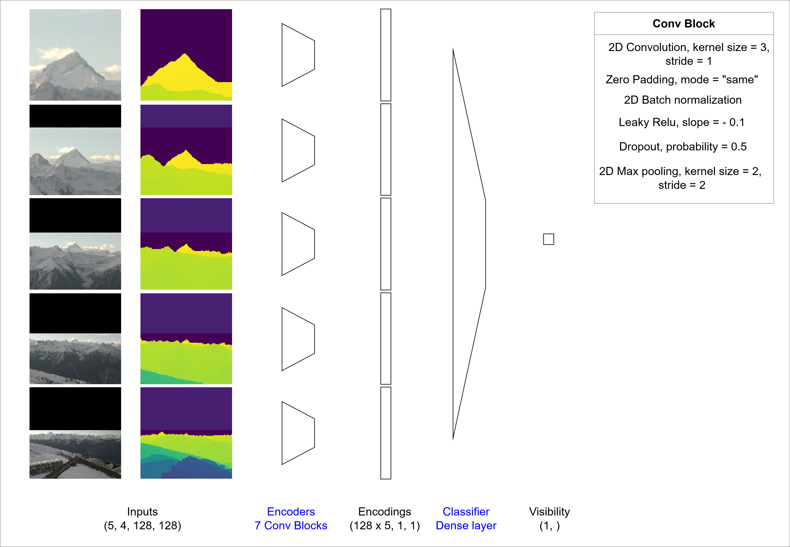

# camvis2 - Estimation of Visibility on Webcam Images using Multi-Magnification Convolutional Networks


## Quickstart
This section provides instruction to build the dataset and replicate the experiments we made. Instructions are provided for Ubuntu/Linux systems only. If you want to use a different OS, you may need to install required libraries manually in order to avoid compatibility issues.
### Overall Setup

#### Enable GPU Acceleration
If you have a NVIDIA GPU with CUDA capabilities, it is strongly advised to use it for computations.
You can determine if you already have a GPU driver and its version by executing the following command.
```bash
nvidia-smi
```
If you don't have one yet, you can find an appropriate driver for your graphics card on the [NVIDIA Download Drivers](https://www.nvidia.com/Download/index.aspx?lang=en-us) webpage so you can speed up your computations.

If you have an AMD GPU with ROCm capabilities, you can use it instead of an NVIDIA GPU. To do this, you will have to install dependencies without versions matching and use the ROCm version of pytorch.

Finally, if you don't have a GPU, you'll have to install dependencies without versions matching and use the CPU version of torch. It is however noteworthy that while inference using the CPU is doable, training a model on CPU is generally extremely time consuming and thus not advised.

#### Setup the Environment
In order to install dependencies, it is advised to create a virtual environment. We recommand to install and use [pyenv](https://github.com/pyenv/pyenv), although any python environment manager will do.
You can create a virtual environment (and enable it) as shown in the command below (replace myenv with the desired name). 

It is advised to use Python 3.10.12 as other versions could lead to compatibility issues. If you want to use a different version, you might need to install the dependencies without versions matching.
```bash
pyenv virtualenv 3.10.12 myenv
pyenv activate myenv
```

#### Install Dependencies (A) With Versions Matching
Now that the virtual environment is created, you can install the needed libraries provided in the requirements.txt file as follows : 
```bash
pip3 install --upgrade pip
pip3 install -r utils/requirements.txt
```

#### Install Dependencies (B) Without Versions Matching
Alternatively, you can install the required packages without specifying the version you want. This allows for a more flexible install in case the fixed version install failed, or if you want to use a specific version of python or an AMD GPU. However, this might cause some errors as code may become deprecated in future versions of packages.

First, update your package installer (command provided for pip)
```bash
pip3 install --upgrade pip
```

Then, go on the pytorch [start locally](https://pytorch.org/get-started/locally/) page. There, you can set your OS, package installer etc and get the appropriate command to install pytorch in your environment. If you want to use an AMD GPU, you'll have to select the ROCm compute platform. For CPU, select the CPU compute platform. For an NVIDIA GPU, select a CUDA platform.

Once you ran your install command, install the remaining dependencies as follows.
```bash
pip3 install -r utils/requirements_no_version.txt
```

#### Check Dependencies
In oder to check whether all dependencies are correctly installed and imported you can run the command below.
```bash
python utils/check_imports.py
```
If you get no error and the message "All packages have been successfully imported" appears in your console, you should be good to go!

### Dataset Creation
Download the webcam images and the depthmaps from this link *link to come*. 
Uncompress the depth_maps.tar.gz file and put its contents in [data/raw/depth_maps](data/raw/depth_maps).
Similarly, put the content of the uncompressed images.tar.gz in [data/raw/images](data/raw/images). 
You can now create the dataset files by executing the command below.
```bash
python data/make_dataset.py
```
In addition to the .gitkeep file, you should now have 5 .pt files and the metadata csv file in the [data/processed](data/processed) directory

### Model Training and Evaluation
In this section, you will find information on how to train and evaluate a model architecture on the dataset you previously computed. You will train the model architecture using a 9-fold cross validation and visualize the validation performance on each fold using bootstrapping. In this case, we train our best performing architecture, and we call the experiment **mymodel**.

The [model/run.py](model/run.py) script allows to launch experiments. It comes with a parser that allows to define, among other things:  
+ whether we want to run the model in training or inference mode
+ what is the model architecture going to be
+ typical hyperparameters
+ files to save logs and checkpoints of model weights

#### Train the Model
For convenience, we provide bash files with pre-written run.py commands and arguments. However, it is strongly advised to familiarize yourself with the run.py arguments parser if you want to use this project more extensively. You can find information about how to use it in the [Run Parser](#run-parser) section.
To train the model on the training sets of each fold, execute the following script.
```bash
bash run_scripts/train_model.sh
```

Training the model on 9 different folds takes close to 7 hours when using an NVIDIA A100 GPU. 

You can follow the training of the model on each fold using TensorBoard. To launch a TensorBoard session, run the command below in another terminal.
```bash
tensorboard --logdir outputs/training_logs
```

#### Evaluate the Model
Once model weights are trained, you can infer on the validation sets for each fold by executing the command below.
```bash
bash run_scripts/eval_model.sh
```

#### Visualize Results
For each fold, you can see the results of the inference on the validation set in subdirectories of [outputs](outputs), in the directories named with **mymodel** and a fold. 
+ Confusion matrices are available in [outputs/val_cf_matrices](outputs/val_cf_matrices)
+ Ground-truth and prediction on webcam images are available in [outputs/val_images](outputs/val_images)
+ Histplots of distance vs visibility are available in [outputs/val_histplots](outputs/val_histplots)
+ Bootstrapped performance metrics in terms of loss, accuracy and F1 score are available in [outputs/val_scores](outputs/val_scores)

Once everything is finished, you can create visualizations of the results using the command below. NB the `-v` flag will show graphs in a pop-up window. You can remove it if you don't want it.

```bash
python outputs/visualize_scores.py -n mymodel -s -v
```
This will create a subdirectory in [outputs/val_scores](outputs/val_scores) with the same name as the scores file. Inside the directory, you can find visualizations of accuracies, F1 scores and loss values across folds for this model architecture.

### Architecture Comparison Experiment
In this experiment, you will train two model architectures using a 9-fold cross validation and compare the results using bootstrapping on the validation performance. One of the model architecture concatenates the features of the patches at different magnification levels, while the other one appends them with scaling so that features are physically aligned from one level to another. Thus, the two architectures are called **cat** and **align** and we call this experiment **cat_vs_align**.

Feel free to experiment with different model architectures by altering the bash files below. You can find information about the model architecture in the [Model](#model) section below.

#### Train the Models
To train the models on the training sets of each fold, execute the following script.
```bash
bash run_scripts/train_cat_vs_align.sh
```
Training the 18 models (2 architectures times 9 folds) takes close to 15 hours when using an NVIDIA A100 GPU. 

Here again, you can follow the training of the models using TensorBoard. To launch a TensorBoard session, run the command below in another terminal.
```bash
tensorboard --logdir outputs/training_logs
```

The models checkpoints are saved in the [outputs/checkpoints](outputs/checkpoints) directory.


#### Evaluate the Models
Once model weights are trained, you can infer on the validation sets for each fold and model by executing the command below. 

If you compare the eval bash file to that of the previous experiment, you can observe that we added the --EVAL_GROUP flag, which allows to specify to which group the model belongs. This will come in handy when we will compare plots of model performance. NB [outputs/visualize_scores.py](outputs/visualize_scores.py) is designed so that it can show up to 8 groups of models simultaneously.

Since we are comparing two architectures, we use **cat** and **align** as the two groups. 
```bash
bash run_scripts/eval_cat_vs_align.sh
```

#### Visualize Results
Here again, for each model, you can see the results of the inference on the validation set in subdirectories of [outputs](outputs).
+ Confusion matrices are available in [outputs/val_cf_matrices](outputs/val_cf_matrices)
+ Ground-truth and prediction on webcam images are available in [outputs/val_images](outputs/val_images)
+ Histplots of distance vs visibility are available in [outputs/val_histplots](outputs/val_histplots)
+ Bootstrapped performances in terms of loss, accuracy and F1 score are available in [outputs/val_scores](outputs/val_scores)

Once everything is finished, you can create visualizations of the results using the command below.

```bash
python outputs/visualize_scores.py -n cat_vs_align -s -v
```
This will create a subdirectory in [outputs/val_scores](outputs/val_scores) with the same name as the scores file. Inside the directory, you can find visualizations of accuracies, F1 scores and loss values across folds and model architectures.

### Clean the Outputs Folder
If you want to start new experiments and get rid of generated outputs, you might want to do it systematically rather than manually using bash commands. You can use commands as displayed below to do so. However, we strongly recommend carefully reading the commands and making sure that they are adapted to the directory structure. If it is not the case, you may end up losing the wrong files.
```bash
# remove files except .gitkeeps
find outputs/ -type f ! -name ".gitkeep" ! -name "*.py" -exec rm -f {} +
# remove empty directories
find outputs/ -mindepth 1 -type d -empty -exec rmdir {} +
``` 

## Highlights on Project Components

### Data
The data we use to predict visibility is made of webcam images and depth maps (3D renderings of the landscape as seen by the camera), see the example below.

")

The training labels are provided as segmentation masks that have been created manually. An example of an image and the corresponding annotation of visible and non-visible regions is shown below. The green mask is for pixels which are in front of the visibility limit and the magenta mask contains parts that are behind the visibility limit.


We sample 500 patches per image. Since close-by objects take up a greater portion of the image, we perform weighted sampling to obtain a balanced set of patches across all visible depths. You can see an illustration of the patch sampling process in the image below. The distribution of depth values is shown in the top left figure. From this distribution, we can derive the scarcity of the depths which are then used as sampling weights. The distribution of depths in the sample is much more uniform than the initial distribution, as you can see on the bottom left plot. On the bottom right, you can see the center pixels of the sampled patches.


### Model
In this section, we explain our main model architecture as well as modifications that can be brought to the model. The model implementation in pytorch is available in the [model/model.py](model/model.py) script. You can see the model architecture and number of parameters with the different possible configurations by executing the command below.
```bash
python model/model.py
```

#### Basic Model
Our model is a multi-magnification model, which means that it leverages several concentric patches corresponding to multiple levels of magnification. It is inspired by the architectures proposed in [(Ho et al., 2021)](#2). The authors propose to leverage multiple levels of magnification to address a segmentation task with few expert annotations but high resolution images, which relates to our task. The model in its simplemost version can be sketched as follows.



At each magnification level, the patch (a 128x128x4 tensor composed of RGB and depth channels) is encoded using a convolutional encoder made of seven convolutional encoding blocks. Then, the encodings of each patch are concatenated, and fed to a linear layer classifier.

Here is a basic example of how to use the model
```python
import torch
from model/model import MultiMagnificationNet

net = MultiMagnificationNet(num_levels=4, num_channels=4, size_hidden=128)
input_data = torch.randn(32, 16, 128, 128)  # Batch size of 32, 4 input channels per magnification level, image size 128x128
output = multi_magnification_net(input_data).squeeze() # Output of size 32 
```

#### Classifier Variants
While using a linear layer as a classifier, being able to apply a final non-linearity after the encoding might be beneficial in some cases. For this reason, we introduce a modified version of the model architecture which allows to switch the classifier to a Multi-Layer Perceptron. It is a one hidden layer MLP, and the size of the layer is equal to the number of hidden channels used in the encoder. 


To enable it, set the `use_mlp` argument to `True`.

```python
net = MultiMagnificationNet(num_levels=4, num_channels=4, size_hidden=128, use_mlp=True)
```

#### Weight Sharing
Since features appearing at different levels might be similar, it makes sense to try and share the weights of the encoders applied on the patches at different magnification levels, as suggested in [(Ly et al., 2020)](#2). This allows to drastically reduce the number of weights to train, which is beneficial given the scarcity of labels.


To enable weight sharing, set the `share_weights` argument to True when declaring the model.

```python
net = MultiMagnificationNet(num_levels=4, num_channels=4, size_hidden=128, share_weights=True)
```

#### Features Alignment
While concentric patches provide both high resolution close to the center pixel and greater contextual information, they have the drawback that the patch contents are not aligned across the magnification levels. For example, the content of a patch at a given magnification level in the top left corner does not correspond to that of another magnification level. With this in mind, concatenating features as in the initial architecture proposition might seem odd. 

To align the patch contents across magnification levels, we propose the following method. Instead of concatenating the encodings of each magnification level, we encode the first image (at full resolution), and we stack its encoding to the second level of magnification image. We then repeat the process until all the levels are encoded. The classification process remains unchanged. We use a simple convolutional encoding block at each level of encoding. Since the spatial dimension of the signal decreases by a factor of two when passed through an encoding block, we pad the output with zeros to match its original dimensions. In this way, the encodings of the previous level can be matched to the next lower magnification level, and the image contents that are visible at both levels are spatially aligned.


In order to enable the alignment of features, set the `align_features` argument of the model to `True`.
```python
net = MultiMagnificationNet(num_levels=4, num_channels=4, size_hidden=128, align_features=True)
```

#### Best Model
According to our experiments, the scores are higher when using the model with a Multi-Layer Perceptron as a classifier, weight sharing and no features alignment.

In order to declare our best model configuration, you can use the following command.
```python
net = MultiMagnificationNet(num_levels=4, num_channels=4, size_hidden=128, share_weights=True, use_mlp=True, align_features=False)
```

If you want to find out by yourself which of the architectures works best, you can repeat the experiment by executing the following commands in your terminal.
```bash
bash run_scripts/train_all_architectures.sh
bash run_scripts/eval_all_architectures.sh
python outputs/vizualize_scores -n all_architectures -v -s
```

Your results should be as follows (for the accuracy score)


With the model types meaning the following: 
Name | type_1 | type_2 | type_3 | type_4 | type_5 | type_6 | type_7 | type_8
--- | --- | --- | --- | --- | --- | --- | --- | ---
**MLP** | yes | yes | yes | yes | no | no | no | no
**Weights sharing** | yes | yes | no | no | yes | yes | no | no
**Features alignment** | yes | no | yes | no | yes | no | yes | no 

### Run Parser
In order to execute runs using our model, we implemented an argument parser that aims to capture all the settings one might want to experiment with. The code of the parser is in  [model/run.py](model/run.py). To see the different arguments and default values, execute the following command.
```bash
python model/run.py -h
```

All the listed arguments can be set on the command line as follows.
```bash
python model/run.py --ARGUMENT_A value_a --ARGUMENT_B value_b # And so on ...
```

You will want to explicitly set some of the parameters for each run. These may include parameters like:
+ --RUN_MODE: whether you are running a training or an inference of the model
+ --MODEL_NAME: your model name to save/load your trained model weights
+ ...

For arguments that you are not going to change from one run to the next, it could be helpful to change their default values in the [model/run.py](model/run.py) file. For example:
+ --DEVICE: device on which you want to execute your computations
+ --NUM_WORKERS: number of CPU threads dedicated to loading the data
+ ...

### Dataset Class
The dataset class allows to rapidly load and feed the appropriate data to our model in batches. It is based on a [pytorch dataset class](https://pytorch.org/tutorials/beginner/basics/data_tutorial.html#creating-a-custom-dataset-for-your-files) and has a few additional custom methods and features exposed below. The code of the dataset class is available in [model/dataset.py](model/dataset.py). You can see what a batch of data looks like by executing the command below.
```bash
python model/dataset.py
```

Proceed as follows to declare the dataset.
```python
from model/dataset import MultiMagnificationPatches
dataset = MultiMagnificationPatches(dataset_path="/data/processed", demagnification_factors=[2,4,8,16,32], random_seed=42, val_view="1148_1", test_view="1206_4")
```

#### Data Pre-Loading
If the dataset is small enough, we can afford to load it completely into RAM, instead of iteratively reading the chunks we need to create each batch. This reduces the training time significantly, as disk read operations are costly.

Our dataset can be saved in an optimized way, which reduces its size to 13 GB. We thus directly load all the image and depth data and the metadata in the dataset initialization. When created using  [data/make_dataset.py](data/make_dataset.py), the data is stored as follows: 
+ The center coordinates of the patch, as well as the ID of the reference image (out of 121 images) and depthmap (out of 9 depthmaps) are stored in the `metadata.csv` file
+ The label of the patch center pixel (either visible or non-visible) is also saved in `metadata.csv`
+ For each magnification level, resized versions of the complete images and depth maps are stored in a separate .pt file

#### Data Fetching
In oder to create a training pair of patch input and target class output, we use the patch coordinates of the input to crop the images and depth maps at the different magnification levels. The cropped images are then stacked into a single tensor and the label is obtained from the metadata file.

#### Swapping Sets
The Dataset class has built-in methods to use only the desired data subset. They work as follows.
```python
dataset.train() # to fetch only training data using getitem
dataset.val() # to fetch only validation data using getitem
dataset.test() # to fetch only test data using getitem
dataset.all() # to fetch all data
```

#### Class Balancing
Since the number of non-visible patch center pixels is much smaller than the visible pixels in our dataset, we rebalance the data, such that the model sees the same amount of examples from each class during training. To do so, we compute the amount of examples from the non-visible class and then sample the same amount of examples from the visible class. The sampling is repeated every time the dataset is set to train mode, so the diversity in the training data is not reduced. The sampler is implemented in the `resample_positives` method.

### Experiment Class
The Experiment class allows to declare the correct dataset and model according to the parser, and then perform the run using its methods. The code for the experiment class is stored in the [model/experiment.py](model/experiment.py) file.

The main components of the `Experiment` class are:
+ Initialization: declaration of model, dataset, optimizer, loss function, loading of pretrained weights
+ Training: Forward and backward passes on training samples, forward passes on validation samples, metrics logging, model weights save, repetition at each epoch
+ Evaluation: Forward passes on validation samples, metrics logging with bootstrapping, creation of output images and plots

## References

<a id="1">[1]</a>  Ho, D. J., Yarlagadda, D. V., D’Alfonso, T. M., Hanna, M. G., Grabenstetter, A., Ntiamoah, P., ... & Fuchs, T. J. (2021). Deep multi-magnification networks for multi-class breast cancer image segmentation. Computerized Medical Imaging and Graphics, 88, 101866.

<a id="2">[2]</a>  Ly, C., Vachet, C., Schwerdt, I., Abbott, E., Brenkmann, A., McDonald, L. W., & Tasdizen, T. (2020). Determining uranium ore concentrates and their calcination products via image classification of multiple magnifications. Journal of Nuclear Materials, 533, 152082.
